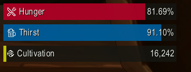

# Cultivation

Condense your core, survive the wilds, master arts, reach the peak.

Roleplay addon with Chinese cultivation (xianxia) flavour: **Five Grains** (hunger), **Jade Spring** (thirst), and **Golden Core** (cultivation). Meters, tooltips, and notifications use an arrogant, in-world tone.

## Five Grains (Hunger)

Drains with activity—idle, walking, running, swimming, flying, combat. Combat drains from full to empty in ~30 minutes of active fighting. Eat food to recover. Higher cultivation slows decay, improves food efficiency, adds a floor so you never fully starve, and lets you recover while resting.

## Jade Spring (Thirst)

Same as Five Grains: drains with activity, ~30 minutes in combat from full to empty. Drink to recover. Cultivation rewards apply (slower decay, better drink efficiency, floor, resting recovery).

## Golden Core (Cultivation)

Passively increases over time. Reaching milestones (cores) reduces hunger/thirst decay and unlocks more rewards:

- **Red** → **Orange** (-10%) → **Yellow** (-20%) → **Green** (-30%) → **Blue** (-40%) → **Violet** (-50%) → **White** (-60%) → **Black** (-80%) decay reduction

**Cultivation rewards (scaling with tier):** decay reduction, food/drink efficiency, resting recovery (%/min while resting), and a floor so hunger/thirst never drop below a minimum (you can still reach 100% satiation).

Increase cultivation faster by fighting (3×), by manually cultivating, or by having a companion (non-combat pet) summoned (+5%). Use `/c cultivate` or sit on a vehicle to toggle. Many players use the *Comfortable Pile of Pelts* toy for active cultivation.

- **On reload:** Cultivation state (aura on/off) restores automatically.
- **Offline catch-up:** If you were cultivating when you logged out, you get up to 2 hours of rested cultivation (80% rate) when you log back in.
- **Milestones:** Reaching a new core announces to Steady Mountain Sect (channel 5).
- **Combat summary:** After combat, a single “Battle Refinement” toast shows qi refined (time in combat). Multiple combats are combined into one notification 10 seconds after the last combat end; the toast never appears while you are still in combat.

## Resting

Slows hunger/thirst decay and grants resting recovery (scales with cultivation). Boosts cultivation rate.

## Player Campfires

Boost drain rates and open-world cultivation (up to 4× near a fire).

## Well Fed

Boosts cultivation and greatly reduces hunger/thirst decay when active.

## Performance

Calculations run on a simulation tick (1s normally, 2.5s in combat/instance). Meter and aura animations run at ~15 FPS (~10 in combat/instance) so the addon stays light on CPU.
